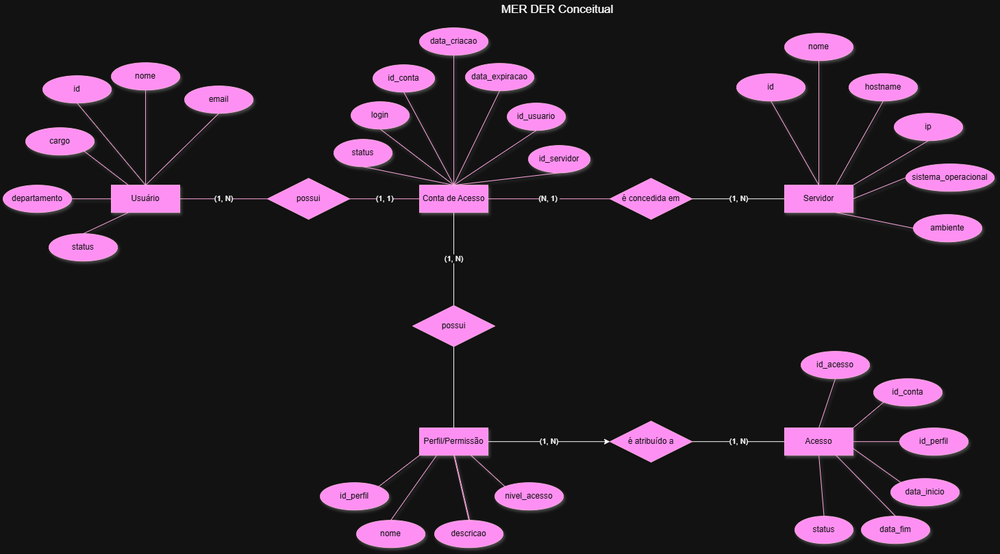
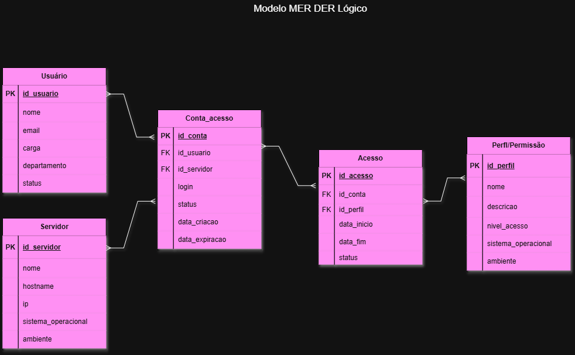

# Projeto -  Provisionamento de acessos a servidores




## Dicionário de Dados

### Usuário

| Campo | Tipo | Descrição |
|---|---|---|
| id_usuario | int | Identificador único do usuário |
| nome | varchar(100) | Nome do usuário |
| email | varchar(100) | E-mail do usuário |
| cargo | varchar(100) | Cargo do usuário |

### Servidor

| Campo | Tipo | Descrição |
|---|---|---|
| id_servidor | int | Identificador único do servidor |
| nome | varchar(100) | Nome do servidor |
| ip | VARCHAR(45) | Endereço IP do servidor |
| sistema_operacional | varchar(100) | Sistema operacional do servidor |

### Conta de Acesso

| Campo | Tipo | Descrição |
|---|---|---|
| id_conta | INT | Identificador único da conta |
| login | varchar(100) | Login utilizado para acessar o servidor |
| senha | varchar(100) | Senha da conta |
| status | varchar(20) | Status da conta |
| id_usuario | int | Identifica o usuário dono da conta |
| id_servidor | int | Identifica o servidor ao qual a conta possui acesso |

### Perfil de Permissão

| Campo | Tipo | Descrição |
|---|---|---|
| id_perfil | int | Identificador único do perfil |
| nome | varchar(100) | Nome do perfil de permissão |
| descricao | varchar(255) | Descrição das permissões do perfil |

### Acesso

| Campo | Tipo | Descrição |
|---|---|---|
| id_acesso | int | Identificador único do acesso |
| id_conta | int | Identifica a conta de acesso |
| id_perfil | int | Identifica o perfil de permissão |
| data_inicio | date | Data de início do acesso |
| data_fim | date | Data de término do acesso |


# Dados de teste em CSV 

# Dados de Teste

- [Usuário](./usuario.csv)
- [Servidor](./servidor.csv)
- [Conta de Acesso](./conta_acesso.csv)
- [Perfil de Permissão](./perfil.csv)
- [Acesso](./acesso.csv)

# Script SQL DDL (Desenvolvimanto: Criação do Banco de dados)

```
CREATE DATABASE IF NOT EXISTS provisionamento_acessos;
USE provisionamento_acessos;

CREATE TABLE usuario (
    id INT PRIMARY KEY AUTO_INCREMENT,
    nome VARCHAR(100) NOT NULL,
    email VARCHAR(100) NOT NULL,
    cargo VARCHAR(100),
    departamento VARCHAR(100),
    status VARCHAR(20) NOT NULL
);

CREATE TABLE servidor (
    id INT PRIMARY KEY AUTO_INCREMENT,
    nome VARCHAR(100) NOT NULL,
    hostname VARCHAR(100) NOT NULL,
    ip VARCHAR(45) NOT NULL,
    sistema_operacional VARCHAR(100),
    ambiente VARCHAR(20) NOT NULL
);

CREATE TABLE conta_acesso (
    id_conta INT PRIMARY KEY AUTO_INCREMENT,
    id_usuario INT NOT NULL,
    id_servidor INT NOT NULL,
    login VARCHAR(100) NOT NULL,
    status VARCHAR(20) NOT NULL,
    data_criacao DATE NOT NULL,
    data_expiracao DATE,
    FOREIGN KEY (id_usuario) REFERENCES usuario(id),
    FOREIGN KEY (id_servidor) REFERENCES servidor(id)
);

CREATE TABLE perfil_permissao (
    id_perfil INT PRIMARY KEY AUTO_INCREMENT,
    nome VARCHAR(100) NOT NULL,
    descricao VARCHAR(255),
    nivel_acesso VARCHAR(50) NOT NULL
);

CREATE TABLE acesso (
    id_acesso INT PRIMARY KEY AUTO_INCREMENT,
    id_conta INT NOT NULL,
    id_perfil INT NOT NULL,
    data_inicio DATE NOT NULL,
    data_fim DATE,
    status VARCHAR(20) NOT NULL,
    FOREIGN KEY (id_conta) REFERENCES conta_acesso(id_conta),
    FOREIGN KEY (id_perfil) REFERENCES perfil_permissao(id_perfil)
);
```

# Script SQL DML(Manipulação: População com dados de teste)

````
USE provisionamento_acessos;

INSERT INTO usuario (nome, email, cargo, departamento, status) VALUES
('Ana Guedes', 'ana.guedes@empresa.com', 'Desenvolvedora', 'Tecnologia', 'Ativo'),
('Marcos Dias', 'marcos.dias@empresa.com', 'Analista de Sistemas', 'Tecnologia', 'Ativo'),
('Beatriz Carvalho', 'beatriz.carvalho@empresa.com', 'Gerente', 'Administrativo', 'Ativo');

INSERT INTO servidor (nome, hostname, ip, sistema_operacional, ambiente) VALUES
('Servidor Web', 'SRV-WEB-01', '192.168.1.10', 'Ubuntu Server 24.04', 'Produção'),
('Servidor Banco', 'SRV-DB-01', '192.168.1.20', 'Ubuntu Server 24.04', 'Produção'),
('Servidor Testes', 'SRV-TEST-01', '192.168.1.30', 'Windows Server 2022', 'Testes');

INSERT INTO conta_acesso (id_usuario, id_servidor, login, status, data_criacao, data_expiracao) VALUES
(1, 1, 'ana.guedes', 'Ativa', '2026-09-01', NULL),
(2, 2, 'marcos.dias', 'Ativa', '2026-09-02', NULL),
(3, 3, 'beatriz.carvalho', 'Ativa', '2026-09-03', '2026-12-31');

INSERT INTO perfil_permissao (nome, descricao, nivel_acesso) VALUES
('Leitura', 'Permite consultar informações sem alterar dados.', 'Baixo'),
('Desenvolvedor', 'Permite executar atividades de desenvolvimento no servidor.', 'Médio'),
('Administrador', 'Permite administrar recursos e configurações do servidor.', 'Alto');

INSERT INTO acesso (id_conta, id_perfil, data_inicio, data_fim, status) VALUES
(1, 2, '2026-09-01', NULL, 'Ativo'),
(2, 3, '2026-09-02', NULL, 'Ativo'),
(3, 1, '2026-09-03', '2026-12-31', 'Ativo');
```